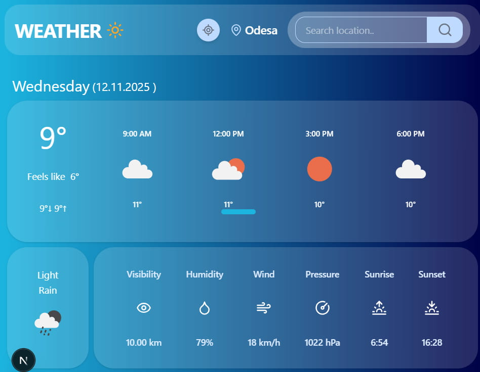

# 🌤️ WEATHER APP

---

## Weather Forecast:
- **This application was created to make it easy for users to check the weather forecast.**

---

### Key Features:
- **Detailed forecast for the current day** - includes temperature, wind speed, humidity, pressure, and other parameters.
- **Approximate forecast for the next 7 days** - helps users plan trips, outdoor activities, or daily routines.
- **Flexible location search** - provides weather data for any city or location worldwide.

---
### Extra Features
- **Real-time Updates** – automatic data refresh without page reload.
- **Geolocation Support** – detect weather based on the user's current location.
- **Weather Icons & Animations** – visualize weather conditions (sun, rain, snow) with animated icons.
- **Error Handling** – friendly messages in case of missing data or network issues.

### Responsive Design:
- **Fully optimized for mobile, tablet, and desktop screens.**
- **The interface adapts seamlessly to different resolutions, ensuring a smooth user experience on any device.**

---

### Purpose:
- **To deliver fast, accurate, and convenient access to weather information for everyday use.**

---

## Screenshot:

<div style="text-align: center">
  
  </div>

- **Example of the main interface showing current and weekly forecast.**

---

## Technologies Used

| Category            | Technologies                                                                 |
|---------------------|------------------------------------------------------------------------------|
| **Framework**        | Next.js 16                                                                   |
| **Language**         | TypeScript                                                                   |
| **UI & Styling**     | Tailwind CSS 4, clsx, tailwind-merge                                         |
| **State Management** | Jotai, React Query (@tanstack/react-query)                                   |
| **HTTP Client**      | Axios                                                                        |
| **Date Handling**    | date-fns                                                                     |
| **Icons**            | lucide-react                                                                 |
| **Linting & Types**  | ESLint, @types/react, @types/node                                            |

---

## 🚀 Getting Started

To run the project locally:

```bash
npm install
npm run dev


This is a [Next.js](https://nextjs.org) project bootstrapped with [`create-next-app`](https://nextjs.org/docs/app/api-reference/cli/create-next-app).


First, run the development server:

```bash
npm run dev
# or
yarn dev
# or
pnpm dev
# or
bun dev
```

Open [http://localhost:3000](http://localhost:3000) with your browser to see the result.

You can start editing the page by modifying `app/page.tsx`. The page auto-updates as you edit the file.

This project uses [`next/font`](https://nextjs.org/docs/app/building-your-application/optimizing/fonts) to automatically optimize and load [Geist](https://vercel.com/font), a new font family for Vercel.

## Learn More

To learn more about Next.js, take a look at the following resources:

- [Next.js Documentation](https://nextjs.org/docs) - learn about Next.js features and API.
- [Learn Next.js](https://nextjs.org/learn) - an interactive Next.js tutorial.

You can check out [the Next.js GitHub repository](https://github.com/vercel/next.js) - your feedback and contributions are welcome!

## Deploy on Vercel

The easiest way to deploy your Next.js app is to use the [Vercel Platform](https://vercel.com/new?utm_medium=default-template&filter=next.js&utm_source=create-next-app&utm_campaign=create-next-app-readme) from the creators of Next.js.

Check out our [Next.js deployment documentation](https://nextjs.org/docs/app/building-your-application/deploying) for more details.
